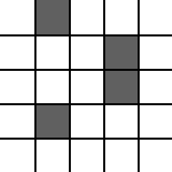
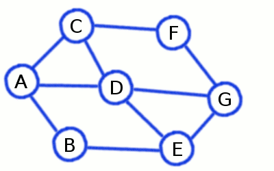

# Graphs


## Terminology

### Nodes

Also known as  _Vertices_

Nodes are the points in a network graph that [edges](#edges) connect to.
They can display or represent people, places or any object

- We denote the vertex set of a graph $G$ by $V(G)$
- A pair of vertices $V_i$ and $V_j$ in $V$ are adjacent if they are connected by an [edge](#edges) .
	- **Adjacency requires a edge between two nodes**
	- The number of adjacent nodes *\[of a vertex\]* is called the [degree](#degree)

#### Isolated node

A node with no edges

- Has a [Degree](#degree) of 0

#### Root node

The starting [node](#nodes). Semantically ambiguous, as the *root node* can imply the starting node of a decision tree, (or any graph) which is correct. But it can also be associated or interchanged with [source nodes](#source-node), which is not preferred. 

#### Source node

- No incoming edges
- Only outgoing edge(s)

#### Sink node

- No outgoing edges
- Only incoming edge(s)

#### Leaf node

A node of [degree](#degree) 1. Only used when referring to trees.

#### Neighbourhood

The neighbourhood of a vertex $v$ is the set of vertices adjacent to $v$.

#### Order

Number of [vertices](#nodes) a graph has

### Edges

Edges are the lines in-between [Nodes](#nodes) that display a connection between nodes.
Edges represent connections, relations or any logical path.

- We denote the edge set of a graph $G$ by $E(G)$

### Incidence

An **incidence** is a pair $(u,e)$ where $u$ is a [vertex](#nodes), and $e$ is an [edge](#edges) incident to $u$

If the vertex $u$ is connected to $e$; $e$ is an edge incident to $u$

!!! quote "Wikipedia definition"

	In [graph theory](https://en.wikipedia.org/wiki/Graph_theory "Graph theory"), a [vertex](https://en.wikipedia.org/wiki/Vertex_(graph_theory) "Vertex (graph theory)") is **incident** to an [edge](https://en.wikipedia.org/wiki/Glossary_of_graph_theory_terms#edge "Glossary of graph theory terms") if the vertex is one of the two vertices the edge connects.

	An **incidence** is a pair $(u,e)$ where $u$ is a vertex and $e$ is an edge incident to $u$.

### Loops

A loop is an edge that has the same starting and ending [node](#nodes). See node 1 below:


### Paths

A path is the route from one [vertex](#nodes) to another.
A path can contain many edges, or a single. it depends on what nodes are being selected.

- Vertices cannot repeat
- Edges cannot repeat

!!! note

	- [Euler paths](#euler-path) and [Euler circuits](#euler-circuit):
		- Can pass through [nodes](#nodes) more than once.
		- Don't exist if a graph has more than two vertices of odd degree.
		- Exists if all vertices of a graph have even degree.
		- Exists if a connected graph has exactly two odd vertices. The starting point must be one of the odd vertices and the ending point will be the other of the odd vertices.
		- See [here](https://lms.vsvonline.vic.edu.au/pluginfile.php/22968/mod_resource/content/10/3.4%20%20Graph%20Theory%20Intro.pdf#page=11)

	- [Hamiltonian Paths](#hamiltonian-path)
		- Don't have to traverse every [edge](#edges)


#### Euler Path

A [path](#paths) that uses each [edge](#edges) once only without returning to starting [vertex](#nodes) is an Euler path.

- Uses each **edge** once
- Doesn't return to starting vertex

#### Euler circuit

A [path](#paths) that uses each [edge](#edges) once only and returns to starting [vertex](#nodes) is an Euler circuit.

If an undirected graph $G$ is connected and every vertex  (not isolated) in $G$ has an even degree, then $G$ has an Euler circuit.

- Uses each **edge** once
- Does return to starting vertex

#### Hamiltonian Path

A [path](#paths) that passes every [vertex](#nodes) exactly once without returning to starting [vertex](#nodes) is an Hamiltonian path.

- Uses every **node** once
- Doesn't return to starting node

#### Hamiltonian Circuit

!!! note

	This is used very often in this course. See [Travelling salesmen problem](algorithms.md#travelling-salesmen-problem)

A [path](#paths) that passes every [vertex](#nodes) exactly once and returns to the starting [vertex](#nodes) is an Hamiltonian path.

- Uses every **node** once
- Does return to starting node

#### Path graph

A graph that is a path across the diameter


### Transitive closure

Is there a path from $A$ to $B$ ?

The transitive closure of a graph is a graph which contains an edge between $A$ and $B$ whenever there is a directed path from $A$ to $B$. In other words, to generate the transitive closure every path in the graph is directly added as an additional edge.


A graph $G^*$ which is the transitive closure of $G$ will have a directed edge to every node it can traverse to.

### Directed Graph

Also known as a digraph.
A digraph is an ordered pair [G = (V, E)](#graph) of [edges](#edges) $(x,y)$ of arrows "from $x$ to $y$".

Where:
- $x$:
	- Is the tail
	- Is the direct predecessor of $y$
- $y$:
	- Is the head
	- Is the direct successor of $x$

If a [path](#paths) leads from $x$ to $y$, then $y$ is said to be a successor of $x$ and reachable from $x$, and $x$ is said to be a predecessor of $y$.

#### Strongly Connected Digraph

A directed graph $G$ is strongly connected if there is a directed path from every vertex to every other vertex in $G$.


### Undirected Graphs

Undirected graphs have [edges](#edges) that can be travelled along in any direction.

### Dag / DAGS

A [Directed Graph](#directed-graph) with no directed [cycles](#cycle)

- I.e. An [Acyclic](#acyclic) [Directed Graph](#directed-graph)

### Degree

The degree of a [node](#nodes) is the number of [edges](#edges) that come off it.

- Note that a [node](#nodes) of degree zero is called an [Isolated node](#isolated-node)

### Cycle

A cycle in a graph is a path that returns to the starting [node](#nodes).

- Vertices cannot repeat
- Edges cannot repeat
- Loops back to original vertex (repeats on one node)

#### Acyclic

Does not contain any [cycles](#cycle).

### Circuit

A circuit in a graph is a path that returns to the starting [node](#nodes).

- Vertices may repeat
- Edges cannot repeat
- Loops back to original vertex (repeats on one node)

### Walk

- Vertices may repeat
- Edges cannot repeat
- Loops back to original vertex **If it wants to** (repeats on one node)

### Trail

- Vertices may repeat
- Edges cannot repeat

### Graph definition

A graph $G$ is a finite non-empty set of objects called vertices or [nodes](#nodes) which are connected by [edges](#edges).

### Measures of Similarity

The similarity measure is the measure of how much alike two data objects are. Similarity measure in a is a distance with dimensions representing features of the objects. If this distance is small, it will be the high degree of similarity where large distance will be the low degree of similarity.

Two main consideration about similarity:

Similarity = 1 if $X = Y$ (Where $X$, $Y$ are two objects)
Similarity = 0 if $X \neq Y$

!!! warning

	writing this in 2025. Never seen cosine simularity anywhere. dw about it

Best example in the world:


!!! note

	https://lms.vsvonline.vic.edu.au/pluginfile.php/141817/mod_resource/content/4/3.7%20Similarity%20Measures%20of%20Distance.pdf

### Distances

#### Topological distance

The number of edges in the shortest path connecting 2 nodes.
For unweighted graphs, each edge has a nominal distance of 1.

#### Euclidian distance

Is also known as simply distance

Euclidean Distance is the straight line distance between two entities. Which is worked out using **Pythagoras Theorem**

When data is dense or continuous, this is the best proximity measure. 

#### Manhattan distance

Manhattan Distance is the distance restricted to traversal via a street grid between two entities. Which is worked out by adding the vertical and horizontal cells traversed.

In a simple way of saying it is the total sum of the difference between the x-coordinates and y-coordinates.

The [heuristic function](#heuristic-functions) for distance calculation

$$f(n) = |\text{cell}_{row} – \text{goal}_{row}| + |\text{cell}_{col} – \text{goal}_{col}|$$

Which is the absolute cell distance in the $x$ direction plus the absolute cell distance in the $y$ direction. The absolute value is always positive.

#### Cosine similarity metric

Finds the normalised dot product of the two attributes. By determining the cosine similarity, we would effectively try to find the cosine of the angle between the two objects. The cosine of 0° is 1, and it is less than 1 for any other angle. It is thus a judgement of orientation and not magnitude: two vectors with the same orientation have a cosine similarity of 1, two vectors at 90° have a similarity of 0, and two vectors diametrically opposed have a similarity of -1, independent of their magnitude.

### Topological sort

- Directed graphs
- Chop the source nodes of each iteration

Also known as a topological ordering

In computer science a **topological sort** or **topological ordering** of a [Directed Graph](#directed-graph) is a linear ordering of its [vertices](#nodes) such that for every directed edge _uv_ from vertex _u_ to vertex _v_, _u_ comes before _v_ in the ordering.

A topological ordering is possible iff the graph has no directed cycles, that is, if it is a directed acyclic graph ([Dag DAGS](#dag-dags)).


The graph shown above has many valid topological sorts, including:

-   5, 7, 3, 11, 8, 2, 9, 10 (visual top-to-bottom, left-to-right)
-   3, 5, 7, 8, 11, 2, 9, 10 (smallest-numbered available vertex first)
-   5, 7, 3, 8, 11, 10, 9, 2 (fewest edges first)
-   7, 5, 11, 3, 10, 8, 9, 2 (largest-numbered available vertex first)
-   5, 7, 11, 2, 3, 8, 9, 10 (attempting top-to-bottom, left-to-right)
-   3, 7, 8, 5, 11, 10, 2, 9 (arbitrary)

This can be calculated through [Kahn's Algorithm](#kahns-algorithm)

!!! note

	https://en.wikipedia.org/wiki/Topological_sorting

#### Kahn's Algorithm

A [Topological sort](#topological-sort) algorithm, first described by **Kahn** (1962), works by choosing vertices in the same order as the eventual topological sort. First, find a list of "start nodes" which have no incoming edges and insert them into a set $S$; at least one such node must exist in a non-empty acyclic graph. Then:

```js
L ← Empty list that will contain the sorted elements
S ← Set of all nodes with no incoming edges

while S is non-empty do
    remove a node n from S
    add n to tail of L
    for each node m with an edge e from n to m do
        remove edge e from the graph
        if m has no other incoming edges then
            insert m into S
if graph has edges then
    return error (graph has at least one cycle)
else
    return L (a topologically sorted order)
```

### Graph Diameter

!!! note

	Note that the **diameter** is the max graph ecentricity. The radius of the graoh requires a center point to be defined

The longest shortest path between any two nodes counted by edge and weights.

Also defined as the largest distance between any pair of vertices.

- A [disconnected graph ](#disconnected-graph) has a diameter of $\infty$

The examples below have a diameter of 2 (2 edges to traverse to get from a to b):

- A graph of one vertex has diameter 0


*Note that the radius and diameter is counted by the number of edges

---

## Network graphs

### Graph

A graph $G=(V,E)$ is made up of a set of [vertices/nodes](#nodes) ($V$) and a set of lines called [edges](#edges) ($E$) that connect the vertices or nodes.

- $|V|$ is the number of vertices in the graph
- $|E|$ is the number of edges in the graph.

!!! example

	Example:
	Using Graph Notation to define a Graph:
	- $V=\{A,B,C,D,E\}$
	- $E=\{A-B,A-C,A-D,A-E,B-C,B-D,B-E,C-D,C-E,D-E\}$
	- $G=(V,E)$
	- $|V|$ returns 5
		- There are 5 nodes or vertices
	- $|E|$ returns 10
		- there are 10 edges in this graph


#### Sub graph

A graph $H$ is a subgraph of $G$ if $V(H) \subset V(G)$ and $E(H) \subset E(G)$.

We can then obtain $H$ from $G$ by deleting edges and or vertices from  $G$.

#### Simple graph

A simple graph, also called a strict graph is **an unweighted, undirected graph containing no graph loops or multiple edges**.

A simple graph may be either connected or disconnected. Unless stated otherwise, the unqualified term "graph" usually refers to a simple graph.


#### Multigraph

A graph that can have multiple edges between the same pair of nodes. In a road network this could, for example, be used to represent different routes with the same start and end point.

#### Connected Graph

A graph where all [nodes](#nodes) are connected

##### Ring Graph

Also known as a Cycle Graph
A graph that forms a ring

- All nodes have a degree of 2


#### Disconnected Graph

A graph where not all [nodes](#nodes) are connected.

##### Bridge

A bridge is an [edge](#edges) that if deleted would cause the graph to become [disconnected](#disconnected-graph).

##### Cut Node

A Cut Node is an [node](#nodes) that if deleted would cause the graph to become [disconnected](#disconnected-graph).

#### Cyclic Graph

A graph where a [cycle](#cycle) can be formed.

### Complete Graphs

- A complete graph has every pair of [vertices](#nodes) joined by one [edge](#edges).
	- i.e. Every node is connected together by an edge

A complete graph with $n$ [vertices](#nodes) will have a [degree](#degree) of $(n-1)$ for all [nodes](#nodes), and a total of $\frac{n(n-1)}{2}$ edges

For $n$ nodes we usually abbreviate it as $Kn$. For example, $K4$ is the complete graph with four nodes:

The [diameter](#graph-diameter) of a complete graph is 1


### Isomorphic Graphs

Also known as topologically equivalent graphs.

Graphs or networks that look different but represent the same information are said to be **topologically equivalent** or **isomorphic**.

Isomorphic Graphs have the same number of vertices, [edges](#edges) and [connections](#edges) between vertices, but may look completely different.


### Bipartite Graphs

A graph $G$ is bipartite if its vertices can be partitioned into two sets $X$ and $Y$ , called partite sets, such that every edge in $E(G)$ is between a vertex in $X$ and a vertex in $Y$ .


As shown above, bipartite graphs have a [chromatic number](#chromatic-number) of 2

### Trees

- There a no [cycles](#cycle) in a tree
- Trees are [simple](#simple-graph)
- Trees contain no [circuits](#circuit)


For any tree $T = (V, E)$ with $|V|$ = $n$, $|E| = n − 1$.

#### Formal definition of a tree

Or the "*Inductive*"


#### Spanning Tree

A spanning tree is a connected graph that has no [circuits](#circuit) or [cycles](#cycle) ([Acyclic](#acyclic)).

If a graph has $n$ vertices its spanning tree it will have $(n-1)$ edges.

> Minimum amount of edges to connect all nodes


##### Minimum Spanning Tree

A minimum spanning tree is a [spanning tree](#spanning-tree) for a weighted graph whose edges add up to the smallest possible value.

- Found via [Prim's algorithm](graphs.md#prims-algorithm)

A graph can have several minimum spanning trees. For example if we replace all the weights with $1$ in a graph with $n$ vertices. The resulting graph will have $n$ minimum spanning trees.

 If all the edge weights of a given graph are the same, then every spanning tree of that graph is minimum.

##### Spanning Subgraph

A Spanning [Sub graph](#sub-graph) $H$ of a graph $G$ is a [sub graph](#sub-graph) of $G$ such that $V (H) = V (G)$.

#### Decision tree

A tree where each non-leaf node splits off to two other child nodes. If there is one source node, the tree has $n$ vertices and $n - 1$ edges.

##### Random decision forests

Or decision forests, have $n - s$ edges. For $n$ vertices and $s$ source nodes. See my discussion [here](https://math.stackexchange.com/questions/4405339/generalising-an-answer-to-number-of-edges-on-a-decision-tree)

#### Binary tree

A type of [Decision tree](#decision-tree), but with the absence of the decision abstraction, and it's literally just 0,1 or 2 children per parent for the entire graph


!!! note

	https://en.wikipedia.org/wiki/Binary_tree

#### Rooted tree

A rooted tree is **a tree in which a special ("labeled") node is singled out**. This node is called the "root" or (less commonly) "eve" of the tree. Rooted trees are equivalent to oriented trees


#### Forest

A graph with no [cycles](#cycle). More specifically, a disconnected graph, where each connected component is a tree.


For any tree $T = (V, E)$ with $|V|$ = $n$, $|E| = n − 1$.

---

### State Diagrams

A [Directed Graph](#directed-graph) showing connections between states of objects or abstract instances


## Colouring

### Vertex Colouring 

Also known as Chromatic Colouring

- Adjacent nodes cannot be the same colour
- Usually used to represent nodes of conflict


The [chromatic number](#chromatic-number) of this graph is 3. As there are 3 colours.

#### Chromatic Number

The chromatic number of a graph $G$ is the minimum value $k$ for which a $k$-colouring of $G$ exists.


See example [Vertex Colouring](#vertex-colouring)

## Math

### Adjacency Matrix

An adjacency matrix shows weightings of edges on an undirected graph. Where an adjacency matrix of $1$s and $0$s is not weighted, and identifies an edge.

An example of an undirected connected graph with nodes $A$,$B$, and an edge between them

$$
\begin{bmatrix}
0 & 1
\\
1 & 0
\end{bmatrix}
$$

A directed graph where $A$ points to $B$:

$$
\begin{bmatrix}
0 & 1
\\
0 & 0
\end{bmatrix}
$$

The direction can be read from **the left of the matrix** (left side of rows) **to the right** of the row to find the head.

!!! note

	- Undirected graphs are diagonaly symetrical, where directed are not 
	- All adjacency matricies are empty on the diagonal


### Transitive closure matrix

A matrix $(i,j)$ where $1$ represents a valid path from $i$ to $j$, and $0$ otherwise. Where $i$ to $i$ is considered connected $1$. 


### Incidence Matrix

For its simplest form we identify the nodes of a directed graph with numbers $1…n$ and give a matrix $M$ of zeros and ones such that:

$$M_{ij} =
\begin{cases} 
      1 \text{ if } i \text{ and } j \text{ are connected} \\
      0 \text{ otherwise}
\end{cases}
$$

### Distance Matrix

The shortest distances from $A$ to $B$ for each pair of nodes in a graph. Used in the [Floyd-Warshall algorithm](#floyd-warshall-algorithm)


### Adjacency List

A list of adjacent nodes:

$$
\begin{aligned}
A = \{B,C\} \\
B = \{A\} \\
C = \{A\}
\end{aligned}
$$


## Searching graphs

### BFS Breadth First Search

!!! quote

	"The basic idea of breadth-first search is to fan out to as many vertices as possible before penetrating deep into a graph. ”A more cautious and balanced approach.”"


- **To see if a node is connected to another**
- Uses a [queue](computer-science.md#queue) to keep track of nodes to visit soon
- Uses an array/set `seen` to mark visited vertices
- If the graph is connected, BFS will will visit all the nodes
- A BFS tree will show the shortest path from `A` to `B` for any unweighted graph

**Algorithm**:

1. Add initial node to `queue` and mark in `seen`
2. Remove the next element from the `queue` and call it `current`.
3. Get all neighbours of the current node **which are not yet marked in `seen`.**
	1. Store all these neighbours into the `queue` and mark them all in `seen`.
4. Repeat from the step 2 until the `queue` becomes empty.

Gif example of BFS:


SAC example:


**Uses of BFS**

- Check connectivity
- Bucket fill tool in 
- Finding shortest path (when modified. pure BFS will not do this)
- [Diameter](#graph-diameter) of a graph
	- The diameter of a graph is the longest shortest path between any two nodes in a graph. Using BFS in a loop and finding the shortest path starting from every node in the graph, keep record of the longest shortest path found so far.
- Cycle detection
- [Bipartite graph](#bipartite-graphs) detection using BFS
- [Web crawler](https://lms.vsvonline.vic.edu.au/pluginfile.php/141031/mod_resource/content/1/Applications%20of%20DFS%20and%20BFS.pdf#page=4)
- [More](https://lms.vsvonline.vic.edu.au/pluginfile.php/141031/mod_resource/content/1/Applications%20of%20DFS%20and%20BFS.pdf#page=4)

#### Waveform

[BFS Breadth First Search](#bfs-breadth-first-search) can be considered a waveform due to its nature



!!! note

	[VSV](https://lms.vsvonline.vic.edu.au/pluginfile.php/77703/mod_resource/content/6/3.5A%20Breadth%20First%20Search%20-%20WaveForm.pdf)

### DFS Depth First Search

!!! quote

	"The basic idea of depth-first search is to penetrate as deeply as possible into a graph before fanning out to other vertices. ”You must be brave and go forward quickly.”"


- **To see if a node is connected to another**
- Uses a `stack` for storing vertices
- We do not check whether node was seen when storing neighbours in the `stack` - instead we perform this checking when retrieving the node from it.
- Builds a [spanning tree](#spanning-tree) if the graph is [connected](#connected-graph)
	- Creates longer branches than BFS
- Unsuitable for searching shortest paths for unweighted graphs.

**Algorithm**:

1. We add the initial node to `stack`.
2. Remove the next element from the `stack` and call it `current`.
3. If the `current` node was `seen` then skip it (going to step 6).
4. Otherwise mark the current node as `seen`
5. Get all neighbours of the `current` node and add all them to `stack`.
6. Repeat from the step 2 until the `stack` becomes empty.

Gif example of DFS:



Practice example:


**Uses for DFS**

- Detecting cycles in a graph
- Topological sorting
- Path Finding between initial state and target state in a graph
- Finding strongly connected components
- Checking if a graph is [bipartite](#bipartite-graphs)

### Exhaustive search

 Also known as a [brute force](algorithms.md#brute-force) algorithm

[Hamiltonian Circuit](#hamiltonian-circuit) example
 1. Find all Hamiltonian circuits
 2. Find length of of each circuit
 3. Select the circuit with minimal total weight

### Tree traversal

How to search trees:
- Any tree, but normally a [Binary tree](#binary-tree)
- You can use
	- [DFS Depth First Search](#dfs-depth-first-search)
	- Pre-order
		- Hug the left most nodes (recursively the first (left) child in each node)
	- Post-order
		- Same as pre-order, but it goes depth first (prints the deepest left node), and then recursively scales back up
	- In-order
		- [Youtube](https://www.youtube.com/watch?v=5dySuyZf9Qg&ab_channel=MichaelSambol)
		- Go left until you cant, then print - and scale upwards
		- Recursively traverse the current node's left subtree. Visit the current node (in the figure: position green). Recursively traverse the current node's right subtree. 


!!! note

	https://en.wikipedia.org/wiki/Tree_traversal#Pre-order,_NLR

**Definition:**

In computer science, tree traversal (also known as tree search and walking the tree) is a form of graph traversal and refers to the process of visiting (e.g. retrieving, updating, or deleting) each node in a tree data structure, exactly once.


For each of these, consider how you would recursively visit each node, and that 'visiting' a node is a discrete operation and does not happen automatically when you traverse to a node.

Depth-first traversal (dotted path) of a binary tree:
Pre-order (preorder) (node visited at position red 🔴):
    F, B, A, D, C, E, G, I, H;

```
preorder(node):
    if node is None:
        return
    visit(node)
    preorder(node.left)
    preorder(node.right)
```

In-order (node visited at position green 🟢):
    A, B, C, D, E, F, G, H, I;

```
norder(node):
    if node is None:
        return
    inorder(node.left)
    visit(node)
    inorder(node.right)
```

Post-order (node visited at position blue 🔵):
    A, C, E, D, B, H, I, G, F.

```
postorder(node):
    if node is None:
        return
    postorder(node.left)
    postorder(node.right)
    visit(node)
```

## Spanning trees / forests

### Prim's Algorithm

A [greedy](algorithms.md#greedy) algorithm used to find the [minimum spanning tree](graphs.md#minimum-spanning-tree)


!!! NOTE "Online tool"

	https://algorithms.discrete.ma.tum.de/mst/


Algorithm
- Begin at any vertex (**Can be any**) 
- Select the cheapest edge emanating from the vertex
- Look at edges coming from the vertices selected so far. Select the cheapest edge. If the edge forms a circuit discard it and select the next cheapest.
- Repeat until all vertices have been selected. 
- Double check by repeating process with a different starting vertex.

Example:


Pseudocode:

```js
Pick any vertex and add it to “vertices” list

Loop until (“vertices” contains all the vertices in graph)
	Select shortest, unmarked edge coming from “vertices” list
	If (shortest edge does NOT create a cycle) then
		Add that edge to your “edges”
		Add the adjoining vertex to the “vertices” list 
	Endif
	Mark that edge as having been considered
EndLoop
```

Or


Prim's algorithm for finding an [MST](graphs.md#minimum-spanning-tree) is **guaranteed** to produce a correct result

### Kruskal's algorithm

Finds minimum spanning forest by connecting the shortest edges in the graph.


## Shortest Path algorithms

Quickest way to get from $A$ to $B$. Usually by shortest weight.

Scenarios:
- Worst case graph:
	- A [complete graph](#complete-graphs). As it has the most edges.
- Worst case brute force
	- A [complete graph](#complete-graphs) will have the most permutations of paths. It will have: $\sum_{k=0}^{(n-2)} {n\choose k} \cdot k!$

### Dijkstra's algorithm

Pronounced *Dikestra*.
Finds the shortest **greedy** path via a **[priority queue](computer-science.md#priority-queue)**.
- Not [Dynamic Programming](algorithms.md#dynamic-programming)


Worst case performance **Fibonacci heap**:
$$\displaystyle O(|E|+|V|\log |V|)$$

Or for general wiki version:

$$\displaystyle O(|V^2|)$$

- Finds shortest path from starting node, to any other location, not just the desired location.
- Works on weighted, weighted graphs and weighted digraphs. **Where no negative weight cycles exist**

Online example [here](https://algorithms.discrete.ma.tum.de/graph-algorithms/spp-dijkstra/index_en.html)

Pseudocode

```js
Algorithm Dijkstra(Graph, source):
// initialise the algorithm
for each vertex V in Graph G=(V,E) do
	dist[V] := ∞ // Unknown distance from source to v
	pred[V] := undefined // Predecessor node information
	add V to unexplored // Unexplored nodes
End do

dist[source] :=0 // Distance from source to source

while unexplored is not empty do
	V := vertex in unexplored with minimum dist[V] // Greedy Priority Queue
	remove V from unexplored
	for each neighbour N of V do
		thisDist := dist[V] + weight(V, N)
		if (thisDist < dist[N] ) then
			// A shorter path to N has been found
			dist[N] := thisDist // Update shortest path
			pred[N] := V // Update path predecessor
		End if
	End do
End do // shortest path information in dist[], pred[]
```

**Limitations**

- Can't use negative weights

#### Expanding a node

A node is **expanded** when if has been visited:

"**expanded**" relative to a node and Dijkstra's means that it has been processed and the node's distance and predecessor have been recorded 
Dijkstra's always expands the shortest path so far at every loop of the minimum priority queue it selects the minimum "unexpanded" node to expand - Georgia G


See [wiki example](https://en.wikipedia.org/wiki/Dijkstra%27s_algorithm#:~:text=containing%20node%20only-,expanded,-%E2%86%90%20empty%20set%0A%20%20%20%20do)

### Belman-Ford algorithm

Step 1: initialise graph
Step 2: [relax](#relaxation) edges repeatedly
Step 3: check for negative-weight cycles
Output shortest path as a distance and predecessor list (depending on setup)


!!! note "Tool"

	[Online runner](https://algorithms.discrete.ma.tum.de/graph-algorithms/spp-bellman-ford/index_en.html)


Unlike Dijkstra's Algorithm the Bellman-Ford Algorithm does not use a [priority queue](computer-science.md#priority-queue) to process the edges.

In Step 2 ([Relaxation](#relaxation)) the nested for loop process all edges in the graph for each vertex $(V-1)$. Bellman-Ford is not a Greedy Algorithm, it uses Brute Force to build the solution incrementally, possibly going over each vertex several times. If a vertex has a lot of incoming edges it is updating the vertex's distance and predecessor many times.

Pseudocode

```js
function BellmanFord(list vertices, list edges, vertex source)

    // This implementation takes in a graph, represented as
    // lists of vertices (represented as integers [0..n-1]) and edges,
    // and fills two arrays (distance and predecessor) holding
    // the shortest path from the source to each vertex

    distance := list of size n
    predecessor := list of size n

    // Step 1: initialize graph_
    for each vertex v in vertices do

        distance[v] := inf // Initialize the distance to all vertices to ∞
        predecessor[v] :=*null // And having a null predecessor
    
    distance[source] := 0 // The distance from the source to itself is, of course, zero

    // Step 2: relax edges repeatedly
    
    repeat |V|−1 times:
         for each edge (u, v) with weight w in edges do
             if distance[u] + w < distance[v] then
                 distance[v] := distance[u] + w
                 predecessor[v] := u

    // Step 3: check for negative-weight cycles
    for each edge (u, v) with weight w in edges do
        if distance[u] + w < distance[v] then
            error "Graph contains a negative-weight cycle"

    return distance, predecessor
```

!!! note

	https://en.wikipedia.org/wiki/Bellman%E2%80%93Ford_algorithm

#### Relaxation

Relaxation is where estimates are gradually replaced by accurate values, eventually reaching the optimal solution.

### Floyd-Warshall algorithm

Shortest path between all nodes in a graph. By calculating the transitive closure for all paths, and keeping track of the shortest in a $V*V$ matrix.
- Example of [dynamic programming](algorithms.md#dynamic-programming)

Time complexity of:
$$O (|V|^3)$$

- Assumes there are no negative cycles, so this needs to be checked after
- Returns a [Distance Matrix](#distance-matrix) of shortest path weights.
- Dynamic program
- Generates the transitive closure of a graph, if a graph is constructed from the distance matrix output.

```js
Algorithm Floyd-Warshall
input: an edge-weighted graph G;
output: the shortest path distances of all pairs of nodes in G

foreach start in allNodes(G)
	foreach end in allNodes(G)
	set D(start, end) to infinity
	
foreach e in allEdges(G)
	set D(startNode(e), endNode(e)) := w(e)
	
foreach mid in allNodes(G)
	foreach start in allNodes(G)
		foreach end in allNodes(G)
			D(start, end) := min(D(start, end), D(start, mid)+D(mid, end))
		end (* of foreach end *)
	end (* of foreach start *)
end (* of foreach mid *)

return D
```

!!! info

	Good explanation [here](<https://www.youtube.com/watch?v=4OQeCuLYj-4&ab_channel=MichaelSambol)>)

#### Floyd-Warshall  transitive closure algorithm

An altered version of the [Floyd-Warshall algorithm](#floyd-warshall-algorithm) to represent a [Transitive closure matrix](#transitive-closure-matrix).

### Best First Search

**Best-First Search** traverses graphs in a similar way to [DFS Depth First Search](#dfs-depth-first-search) and [BFS Breadth First Search](#bfs-breadth-first-search), with the main difference being that **instead of choosing the first matching successor, we choose the best-matching successor** that we think will take us to the goal vertex.

- Uses a [priority queue](computer-science.md#priority-queue) to keep track and order the best options
	- Each option's suitability is defined through a custom [Heuristic](#heuristic-functions) function $f(n)$
- Can backtrack on older decisions
	- Which means this algorithm is **not** [greedy](algorithms.md#greedy).
		- IFF the search does not discard old paths. i.e. can backtrack.

#### Heuristic functions

AKA: "evaluation function"

$f(n)$ as a heuristic function could be as simple as a *rule of thumb*. Like a pythagorean distance estimate from $A$ to $B$

- Basic *Guess* or *Rule of thumb* towards a better / greedy path
- An educated guess on the cost(s) we may encounter down a particular path
- See [Heuristics evaluation functions](algorithms.md#heuristics-evaluation-functions)
