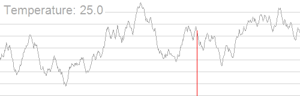

# Algorithms 

!!! danger

    This is a work in progress. Some information may be incorrect or outdated

---


## Definition of an Algorithm

!!! quote

	"An algorithm is an effective method expressed as a finite list of well-defined instructions for calculating a function. [Wikipedia](http://en.wikipedia.org/wiki/Algorithm)"

This means that there is a finite sequence of steps that can be followed mechanically to process specified inputs and correctly produce the expected output. 

Must be (see [Properties of an algorithm](#properties-of-an-algorithm)):

- Well defined
- Finite number of steps
- Not ambiguous

---

## Properties of an algorithm

### Finiteness

There is an exact number of steps to be taken and has and end

### Absence of Ambiguity

Every instruction or action is precise and clear

### Input and Output

The inputs to the problem are defined together with the expected outcome

### Effectiveness

The solution is guaranteed to give the correct answer all of the time for the specified input 

### Sequence of Execution

Actions are performed from top to bottom.

---


### Computability

A problem is computable if it is able to be [modelled](#models-of-computation) on a Turing machine (or equivalent), and solved with unlimited resources in finite time.

#### Models of computation

A model describes how units of computations, memories, and communications are organised.

Models include:

**Sequential models**:
- [Turing machine](computer-science.md#turing-machine)
- [Finite state machines](computer-science.md#finite-state-machines)

**Functional models**
- [Lambda Calculus](#lambda-calculus)
- Combinatory Logic

#### Uncomputability and undecidability

- No algorithm to solve problem = **Uncomputable**
- Uncomputable yes/no problems = **Undecidable**

($m$ is mapping function reduction
$p$ is polynomial reduction)

If $A$ is reducible to $B$ then $A \le m B$

#### Soft limits of computation

The computability that effects the duration and resource usage of computation. Such as the [Time complexity](#time-complexity), [Space complexity](#space-complexity). However, soft limits do not restrict the completion or [Computability](#computability) of an algorithm.

#### Hard limits of computation

The limits that make an algorithm uncomputable. Such as the [Uncomputability and undecidability](#uncomputability-and-undecidability) and [Infinitary systems](#infinitary-systems) of a system?

## Communication of design

How do we effectively communicate the design of our Algorithms to others for solving a “real world” problem?

With:

- Narratives – descriptions / essays
- Process Flows – diagrams/graphs/flowcharts
- Scenario analysis – giving possible interpretations / alternative developments
- System maps – groups information together in hierarchies
- Concept Maps – shows relationships between connected entity
- Prototypes – make a smaller model of the overall problem
- Specifications – details of what criteria need to be met


## Modularity

The use of functions.

Why do each step in the algorithm:

```js
FOR i IN X
	y += i
```

When you can simplify it (with modules):

```js
y = sum(X)
```

An examples of a function `pay_emplyee`


### Modularisation

You can modulize a function/idea from the:

- Top to bottom
	- Starting from the main idea, and breaking into smaller parts
- Bottom to top
	- Starting from the smallest elements, and working upwards to a whole solution
		- By considering how everything is stored with data types


### Pre-computation

If you can compute something before using it, it can some resources:

- This is considered optimistic

If you don't pre-compute:

- You may save on resources
	-  Only if you never needed to compute that data
- or you can lose a lot more resources
	- Because you are computing it multiple times, when you could have just done it once as a pre-computation

## Steps

### Selection step *( if )*

A selection step must have these 2 components:

- A block of steps that may or may not be followed (such as make your lunch, and
- A [condition](#conditions), i.e. a **statement that can either be true or false** (such as you have an Algorithms class today), which determines whether the block of steps should be followed. The block should be followed if the statement is true.

The syntax we will use looks like this: 

```js
IF (condition)
	steps
END IF
```

#### Cascading if

When an if statement has cascading `ELSE IF` statements

```js
IF the student's mark was below 50
{
	write "Fail"
}
ELSE IF the student's mark was below 60
{
	write "Pass"
}
ELSE IF the student's mark was below 70
{
	write "Credit"
}
ELSE IF the student's mark was below 80
{
	write "Distinction"
}
ELSE
{
	write "High Distinction"
}
```

#### Decisions 

Ternary statements are referred to as decisions

```js
if condition then statement A else statement B
```
 
---

## Blocks

### Indentation

Tab or 4 spaces to define blocks

```js
IF it is raining
	put on your jacket
	pick up your umbrella
put your shoes on
go outside
```

### BEGIN/END

BEGIN and END markers are used to define the start and end of blocks

```js
IF it is raining
BEGIN
	put on your jacket
	pick up your umbrella
END
put your shoes on
go outside
```

### Brackets

Similar to the BEGIN and END markers, but blocks are defined with the start and end markers are opened and closed curly brackets respectively (`{`,`}`) 

```js
IF it is raining
{
	put on your jacket
	pick up your umbrella
}
put your shoes on
go outside
```

### Numbered steps

This method is old and outdated. It is not really used in any modern programming languages or algorithms. It doesn't even define blocks.

```js
Step 1: IF it is not raining GOTO step 4
Step 2: put on your jacket
Step 3: pick up your umbrella
Step 4: put your shoes on Step 5: go outside
```

---

## Loops

### Fixed iteration

Loop for a fixed `n` amount of times. 

!!! note

	`n` can be assigned during algorithm, it does not need to be known before starting.

```js
get a bag DO 6 TIMES
{
	pick up a doughnut put it in the bag
}
put the bag on the shelf
```


    
    
### Conditional iteration

Loop while ([condition](#conditions)). The loop runs while a condition is met

```js
WHILE (condition)
{
	run
}
```

Conditional iteration includes the following:
- `DO ... WHILE`
	- "Testing at end"
	- "Repeat until" (reverse bool)
	- Do loop once, then continue while condition is met.
- `WHILE`
	- "Testing at end"
	- Do loop while condition is true.

### Collection iterations

Iterate over collection such as a list with a buffer variable

```js
FOR i IN arr(alphabet)
{
	PRINT i
}

>>> abcdef...
```

---

## Variables

Assigned via:

- $x := y$
- $x = y$ (Unconventional and discouraged)
- $x \leftarrow y$

See [Variables](computer-science.md#variables)

---


## Famous problems

There are problems documented everywhere in this page. I just needed a spot to put TSP

### Travelling salesmen problem

[There are $\frac{!(n-1)}{2}$ possible routes](https://youtu.be/GiDsjIBOVoA?t=194) for a [complete graph](graphs.md#complete-graphs) input. The division of two is to eliminate the other half of paths that go in the reverse order 

> The number of different Hamiltonian cycles in a complete undirected graph on n vertices is $\frac{(n-1)!}{2}$ and in a complete directed graph on n vertices is $(n– 1)!$. These counts assume that cycles that are the same apart from their starting point are not counted separately. ([source](https://en.wikipedia.org/wiki/Hamiltonian_path#Properties))

Also, I'm putting this here as well: 


!!! note "Game"

	[https://algorithms.discrete.ma.tum.de/graph-games/tsp-game/index_en.html](https://algorithms.discrete.ma.tum.de/graph-games/tsp-game/index_en.html)


!!! info

	<iframe width="560" height="315" src="https://www.youtube.com/embed/SC5CX8drAtU" title="YouTube video player" frameborder="0" allow="accelerometer; autoplay; clipboard-write; encrypted-media; gyroscope; picture-in-picture" allowfullscreen></iframe>

	[Traveling Salesman Problem Visualization](https://youtu.be/SC5CX8drAtU)

which is already in [Heuristics evaluation functions](#heuristics-evaluation-functions)

## Sorting

Big $O$ notation:


!!! warning "2023 changes"

	Don't worry about anything other than **worst case complexity**. Average and best have been removed


| Algorithm                                      | Best Time         | Average Time      | Worst Time   | Worst Space |
| ---------------------------------------------- | ----------------- | ----------------- | ------------ | ----------- |
| [Quick Sort](#quick-sort)                                | $\Omega(n\log n)$ | $\Theta(n\log n)$ | $O(n^2)$[^1] | $O(\log n)$ |
| [Selection sort](#selection-sort) (Not in 2021 study design) | $\Omega(n^2)$     | $\Theta(n^2)$     | $O(n^2)$     | $O(1)$      |
| [Merge-sort](#merge-sort)                                |                   |                   |              |             |

[^1]: When the pivot is the lowest item in the input each time. When sorting by ascending [https://youtu.be/auclbmnm4iA?t=69](https://youtu.be/auclbmnm4iA?t=69)

!!! note

	[https://www.bigocheatsheet.com/](https://www.bigocheatsheet.com/)

### Selection sort

Selection sort goes through the whole list, finding the smallest item and moving it to the front.

Order:
1. Sort through and find smallest item
	- Move that item to the front
2. Sort through the array from second element
	- Check every item to find the next smallest element
3. Add the element in front of the first smallest element
4. Continue this on the next element for the rest of the list.

Comparisons of:
*Best and worst case*

$$O(n^2)$$

Swaps of:

$$O(n)$$

### Quick Sort

Quick Sort uses a recursive divide and conquer method.


Order:
1. Select random pivot (usually last)
2. Check every other element in the array
	1. All values less than pivot are on its left
	2. All values higher than pivot are on its right
		1. Do these steps by swapping
3. Do quick-sort on items left of original quick-sort
4. Do quick-sort on items right of original quick-sort

Worst case:

$$O(n^2)$$

Best case (simple partition):

$$O(n\log n)$$

Best case (3 way partition and equal keys):

$$O(n)$$

### Merge-sort


<sup>Gif of mergesort</sup>

## Searching

### linear Search

Most simple, checks elements left to right until the item is found.

Average case:

$$O\left(\frac{n}{2}\right)$$

### Binary Search
 
- Recursive divide and conquer.
- **Must be sorted**

Order:
1. Select item from middle of array
	1. If matches: halt
	2. if item < what your looking for: search right side
	3. if item > what your looking for: search left side

Worst case:

$$O(\log_2 n) \implies O(\log n)$$

*Note that the number of searches in worst case is $\lfloor \log_2(n)\rfloor +1$*


## Types of algorithms

### Design patterns

!!! info

	- Use [Divide and Conquer](#divide-and-conquer) when you **==don't== have overlapping sub problems**
	- Use [Dynamic Programming](#dynamic-programming) when you **==do== have overlapping sub problems**
	- Use [Backtracking](#backtracking) when you need to backtrack 😎

#### Brute Force

Also known as "generate and test"

Checking every possible combination to see if it is valid as you go along. But is the most resource intensive

#### Decrease and Conquer

!!! warning

	**Decrease** and conquer decreases, and does not divide. Hence the time complexity reccurance of:

	$$T(n) = T(n-b)$$ Not $$T(n) = T\left(\frac{n}{b}\right)$$

	[Master theorem](#master-theorem)

Decrease and Conquer algorithms make the problem smaller by reducing problem at each iteration. They can reduce the problem by
- Constant amount
- Variable amount

*Its idea is to exploit the relationship that exists between the solution of a problem and the solution of a smaller instance of the same problem.*

Efficient when the problem can be systematically decreased to a solution

**Steps for Decrease & Conquer:**
- Reduce original problem to a smaller instance of the same problem
- Solve the smaller instance
- Extend the solution of the smaller instance to get the solution to the overall problem

**Examples**:
- [BFS Breadth First Search](graphs.md#bfs-breadth-first-search)
- [DFS Depth First Search](graphs.md#dfs-depth-first-search)


#### Divide and Conquer


!!! warning

	**Divide** and conquer divides, and does not staticly decrease. Hence the time complexity reccurance of:

	$$T(n) = T\left(\frac{n}{b}\right)$$ Not $$T(n) = T(n-b)$$

	[Master theorem](#master-theorem)

When the input size is divided into smaller parts

#### Dynamic Programming


- Bottom up computation
	- Start at base case and build up 
- Useful where we have a straight forward recursive solution to a problem, but the direct recursive implementation is inefficient because it leads to redundant computations.
- Useful where the problem **can only be split into [overlapping sub-problems](#overlapping-sub-problems)**
	- [Decrease and Conquer](algorithms.md#decrease-and-conquer) is only useful when the problem can be split into **non-overlapping** (independent) sub-problems
- Usually has polynomial runtime complexity


Examples:
- [Floyd-Warshall algorithm](graphs.md#floyd-warshall-algorithm)
- [Belman-Ford algorithm](graphs.md#belman-ford-algorithm)

!!! info

	In general, DP solutions are used to maximise or minimise. Knapsack or coin change.

	They store previous answers to stop the repetition of overlapping sub-problems
##### "overlapping sub-problems"

Identical problems that are occurring multiples times during computation

#### Backtracking

>[!warning] Not sure if this is an actual design pattern

lmao sudoku

### Greedy

Choose best looking path (from a [heuristic](graphs.md#heuristic-functions)) and discard? others
- Fast but not always correct

## Heuristics / evaluation functions

Also see [heuristic functions](graphs.md#heuristic-functions)

!!! info

	<iframe width="560" height="315" src="https://www.youtube.com/embed/SC5CX8drAtU" title="YouTube video player" frameborder="0" allow="accelerometer; autoplay; clipboard-write; encrypted-media; gyroscope; picture-in-picture" allowfullscreen></iframe>

	[Traveling Salesman Problem Visualization](https://youtu.be/SC5CX8drAtU)

### Randomisation

For example (TSP):
- Swapping the position of two cities on a route (Mutations)
- [Evolutions](#evolutions)
- Reversing the order of an entire section of a route

#### Mutations

- Random pairwise exchanges
- "swap a set of elements to see if its any better"


#### Evolutions

Algorithm will repeatedly evaluate all the tours in the “dish”
- throw out the longer tours
- replace them with copies of the better tours 
- each copy is slightly different than the tour it was copied from


### \[Continuous\] Hill climbing

When mapping solutions, plot them on a 3d graph, where $z = f(x,y)$ and the peaks ($z$) are the favourable solutions


"Constraints" whilst solving:
- You can't see more than one step ahead
- You can't remember where you've been

Main points
- You do not [backtrack](#backtracking), you do not remember previous positions
- Each Axis/Dimension is a feature of a problem.
	- One axis is the efficacy of the combination of variables solved with an evaluation function. 
		- Such that x and y are the locations on a field and z is how good that spot is for a picnic. 
		- The evaluation function does not need to be directly evaluating variables x and y only. It can use other resources

When traversing the [State space](#state-space) (hills):
- Compute local gradient
	- Find maximal direction
- Take a small step in that direction
- No backtracking, we don't care where we've been


I.e. we try to find the $x,y$ for the highest $z$

#### State space


When stuck at:

- Local maxima:
	- *Restart in random location*
	- [Simulated annealing](#simulated-annealing)
- Shoulders
	- Your step size may need to be dynamically adjusted or it could keep searching till it finds a difference. This could be an algorithm in itself
- Plateaux / Flat local maxima
	- You could treat this the same as a regular local maxima

### Simulated annealing


- Escaping some local maxima can be done by allowing occasional bad moves, decreasing in frequency as the evaluation continues
	- Probability of taking downhill move decreases with number of iterations, steepness of downhill move
	- Controlled by annealing schedule, Inspired by tempering of glass, metal
- One can prove: If temperature decreases slowly enough, then simulated annealing search will find a global optimum with probability approaching one, which means you are certain of your solution. However, this usually takes impractically long.


<sup>**Gif^^**</sup>

!!! info

	<iframe width="560" height="315" src="https://www.youtube.com/embed/iaq_Fpr4KZc" title="YouTube video player" frameborder="0" allow="accelerometer; autoplay; clipboard-write; encrypted-media; gyroscope; picture-in-picture" allowfullscreen></iframe>

	[Simulated Annealing](https://youtu.be/iaq_Fpr4KZc)

## Recursion

Basically, "*Calling a function inside of itself*"


Requirements:
 
- Each recursive function **must** have a terminating condition ([Base case](#base-case)), or be explicitly finite, so it doesn't infinitely call itself.

### Base case

A case to terminate a recursive function:

```js
function factorial(x)
    // Base case (x == 0) or x <= 0
    if x == 0:
        return 1
    else:
        return x*factorial(x-1)
```


## Math 

### Recurrence relation

!!! quote

	In mathematics, a recurrence relation is an equation that expresses the $n$th term of a sequence as a function of the $k$ preceding terms, for some fixed $k$ (independent from $n$), which is called the order of the relation.

i.e, an equation that shows a pattern or relation.

An example with the Fibonacci sequence:

$$F_{n}=F_{n-1}+F_{n-2}$$

Or the factorial:

$${n!=n(n-1)!\quad {\text{for}}\quad n>0,}$$

#### Master theorem

<br>

$$T(\textcolor{red}{n})=\textcolor{orange}{a}T\left(\frac{n}{\textcolor{yellow}{b}}\right)+\textcolor{green}{f(n^k)}$$

Where:

- $\textcolor{red}{n}$ is the original size of the problem
- $\textcolor{orange}{a}$ is the number of subproblems in the recursion (how many times called in the function)
- $\textcolor{yellow}{b}$ is the number of dividing of input data that is done
- $\textcolor{green}{f(n^k)}$ is the cost of the work done outside the recursive call

!!! note

	
	**Only use this formula to practice! this is the one you have on the exam**


!!! warning

	The Master theorem **cannot** be used on recursive algorithms where the **sub-problems overlap**, or decrease and conquor.

	Only recursive divide and conquor when the above applies 

!!! note "Good explanation of trees"

	
	

	[https://www.cs.cornell.edu/courses/cs3110/2012sp/lectures/lec20-master/lec20.html](https://www.cs.cornell.edu/courses/cs3110/2012sp/lectures/lec20-master/lec20.html)

	This method maps out the $f(n)$ work at each call as the node. The summation of the rows's work is on the right. If the summation is always a constant value $A$ for each level, the time complexity is $O(A\cdot\text{height})$, or in this example; a geometric series.

	That is, that you need to work it out without the height. In this series, we can see that the addition of: 

	$$n^2 + \frac{n^2}{2} + \frac{n^2}{4} ... \frac{n^2}{2^i} = \sum_{i=0}^{\log_{2}{n}}\frac{n^2}{2^i}$$

	Which means, as $n$ approaches $\infty$, we are getting $2n^2 \implies O(n^2)$.

	Also, another geometric time complexity is a decision tree, where it expands in $2^n$ time

	

	Another example is $T(n) = T(n/3) + T(2n/3) + n$. I just need to note that:
	- Asymptotic height of tree is longest term -> $T(2n/3)$
		- This term expands the most before it gets to base case of $T(1) = 1$
			- Base case is: $T(1) = T(1/3) + T(2/3) + 1$. But T() terms are zeroed out 
	- This means we have $\log_{\frac{3}{2}}{n}$ height
		- And $\log_{\frac{3}{2}}{n}\cdot n \implies O(n \log n)$


#### Page Rank

The Page rank algorithm or PageRank is a recurrence relation

It ranks websites by the number of incoming links from other websites, where each incoming link is a fraction of all outgoing links from that website

Where $B$ has 2 outgoing links, and $C$ has one. 

$${PR(A)={\frac {PR(B)}{2}}+{\frac {PR(C)}{1}}+{\frac {PR(D)}{3}}}$$

!!! info

	[https://youtu.be/qxEkY8OScYY](https://youtu.be/qxEkY8OScYY)

##### Damping factor

The [Page Rank](#page-rank) theory holds that an imaginary surfer who is randomly clicking on links will eventually stop clicking. The probability, at any step, that the person will continue is a damping factor $d$. Various studies have tested different damping factors, but it is generally assumed that the damping factor will be set around $0.85$. I.e 85% of people will click an outgoing link

The damping factor is subtracted from 1 (and in some variations of the algorithm, the result is divided by the number of documents ($N$) in the collection) and this term is then added to the product of the damping factor and the sum of the incoming PageRank scores. That is,

$$PR(A) = {1 - d \over N} + d \left( \frac{PR(B)}{L(B)}+ \frac{PR(C)}{L(C)}+ \frac{PR(D)}{L(D)}+\,\cdots \right)$$

$L(A)$ is the number of outgoing edges

!!! note

	[https://en.wikipedia.org/wiki/PageRank#Damping_factor](https://en.wikipedia.org/wiki/PageRank#Damping_factor)

### Proof

- The proof of a theorem is often interpreted as justification of the truth of the theorem statement.

#### Empirical analysis

**Definition:**

based on, concerned with, or verifiable by observation or experience rather than theory or pure logic.

This can be done through counter variables

#### Proof by induction


1. We can reach the first step on the ladder
2. If we can reach a particular rung on the ladder, then we can reach the next rung on the ladder.

Can we reach every step on the infinite ladder?

A more mathematical explanation


> Linz, Peter. An Introduction to Formal Languages and Automata : ., Jones & Bartlett Learning, LLC, 1990.


---

Mathematical induction is a rule of inference for a proposition $P(n)$ that tells us:
Prove best case: $P(1)$ by induction for all $k$, $(P(k) \rightarrow P(k+1))$ $\therefore$ for all $n$ property $P(n)$ is true.

So, when proving by induction, do the following:

- Solve for base case of $n=1$
- Solve for case $n=k$
- Then solve for case $n=k+1$ by substituting $n=k$ case (if possible). 

---

From seminar

Consider a **Loop invariant**. Which is some condition that is true before and after each loop. Then use that to build on a True solution / proof

Examples:

- Insertion sort
	- The sub array `a[0:j]` is always sorted.
		- As the algorithm is sorting elements from the front.
		- You can then use this proof to base case an array of len 0, then len j, then as j approaches the  `len(a)`
- Floyd-warshall
	- The sections that have been seen, are shortest distance

#### Proof by contradiction

State the proposition, say "the proof is by contradiction", then contradict your statement, and prove the statement to be impossible. Which contradicts your statement, and means your original proposition is true.

!!! info

	[https://youtube.com/shorts/ErnrcsM1CIk?feature=share](https://youtube.com/shorts/ErnrcsM1CIk?feature=share)


### Axioms


- As classically conceived, an axiom is a premise so evident as to be accepted as true without controversy

- Accepted as truths without requiring proof

Example:

$$1 + 1 = 2$$

### Theorems

- A statement that has been proven on the basis of previously established statements
- Theorems are deductive

Example:

$$c = \sqrt{a^2+b^2}$$


### Finitary systems

- An operation that takes a finite number of input values to produce an output,

#### Infinitary systems

- Operations on infinite numbers of input values are called infinitary

#### Hilbert's program


!!! Warning "2023 changes"

	Much of this description references outdated content.
	**However, Hilbert's Program (in general) is still in the study design**


Sweaty soy-jack Hilbert said he could prove mathematics' natural consistency with a finite set of [Axioms](#axioms) and solve the foundational crisis of mathematics.

He was wrong, see Gödel's Incompleteness Theorem (Not in 2023 course design)

The main goal of Hilbert's program was to provide secure foundations for all mathematics. In particular this should include:

-   A formulation of all mathematics; in other words all mathematical statements should be written in a precise [formal language](https://en.wikipedia.org/wiki/Formal_language "Formal language"), and manipulated according to well defined rules.
-   Completeness: a proof that all true mathematical statements can be proved in the formalism.
-   Consistency: a proof that no contradiction can be obtained in the formalism of mathematics. This consistency proof should preferably use only "finitistic" reasoning about finite mathematical objects.
-   Conservation: a proof that any result about "real objects" obtained using reasoning about "ideal objects" (such as uncountable sets) can be proved without using ideal objects.
-   Decidability: there should be an algorithm for deciding the truth or falsity of any mathematical statement.

The **historical context** was:


!!! info

	Good explanation of the incompletness of mathematics:

	<iframe width="560" height="315" src="https://www.youtube.com/embed/HeQX2HjkcNo" title="YouTube video player" frameborder="0" allow="accelerometer; autoplay; clipboard-write; encrypted-media; gyroscope; picture-in-picture" allowfullscreen></iframe>

	[https://youtu.be/HeQX2HjkcNo](https://youtu.be/HeQX2HjkcNo)

#### Lambda Calculus

An equivalent of the [Turing machine](computer-science.md#turing-machine) invented by Alonzo Church

#### Church-Turing Thesis

- All [computable](#uncomputability-and-undecidability) [algorithms](#definition-of-an-algorithm) are computable given infinite time and space
	- And will complete in a finite amount of time (this is a stupid contradiction and i hate it) **with respect to the [Definition of an Algorithm](#definition-of-an-algorithm)**
- If one can show that a problem cannot be solved on a Turing machine; then it follows that it cannot be solved by any computer or by any human.

**The limitation of the thesis**:
- Computability is only considered on the [Turing machine](computer-science.md#turing-machine) or with [Lambda Calculus](#lambda-calculus), which doesn't consider alternative models of computation.

#### Halting problem

Machine $H$ determines if the input $I$ (program and program input) will halt or not. 


Another machine $H+$ will halt if $H$ outputs `no-halt` and will loop forever if $H$ outputs `halt`.


When inputing $H+$ into $H+$, we get a paradox/contradiction. Basically, if it decides $H+$ will halt, it loops forever. And if $H+$ does not halt, it halts.

Concluding that $H$ cannot exist, and mathematics is [undecidable](#uncomputability-and-undecidability).


!!! info

	Revision [https://youtu.be/HeQX2HjkcNo?t=1506](https://youtu.be/HeQX2HjkcNo?t=1506)

### Summations


#### Average

Average of an array $x$ = $\mu$:

$$\mu = \frac{1}{N}\sum^{N}_{i=1}{x_i}$$

#### Standard deviation

Measure of how spread out numbers are from the [Average](#average) $= \sigma$.


$$\sigma = \sqrt{\frac{1}{N}\sum^N_{i=1}{(x_i-\mu)^2}}$$

### Sequences

The sequence of numbers.


!!! note

	[https://calcworkshop.com/combinatorics/recursive-formula/](https://calcworkshop.com/combinatorics/recursive-formula/)

#### Arithmetic sequence


Not to be confused with the non-linear [Geometric sequence](#geometric-sequence)

A linear mathematical sequence of numbers `3, 8, 13, 18, 23, 28, 33, 38, ...`
 defined as $x\{a_n\} = \{a_0,a_1,a_2,a_3 ... a_n\}$. Can be written as

$$a_n = a_0 + d(n−1), n \ge 1$$

Which is the **closed formula**, or in the **recursive formula**:

$$a_n = a_{n-1} + d$$

##### Summing an arithmetic sequence

How to sum a sequence 

$$a + (a+d) + (a+2d) + (a+3d) + ...$$

With the formula

$$\sum^{n-1}_{k=0}{(a+kd)} = \frac{n}{2}(2a + d(n-1))$$

which is derived from:

$$\sum^{n}_{i=1}{i} = \frac{1}{2} \cdot(n+1)$$

#### Geometric sequence


A non linear sequence of numbers such as `1,2,4,8,16,31,64`

#### Solving

!!! info

	[Telescoping vs Iteration](https://youtu.be/lPCS2FFyqNA)

### Mathematical Analysis

!!! info

	[Khan Academy revision](https://www.khanacademy.org/computing/computer-science/algorithms/asymptotic-notation/e/quiz--comparing-function-growth) - `quiz--comparing-function-growth`


#### Time complexity
##### Big $O$  notation

**Worst Case**

$$O(n)$$

The Big O notation describes how an algorithm scales towards infinity in respect to an input $n$.

Suppose:
- $f(n)$ is the time complexity of an algorithm
- $g(x)$ is an algorithm

then $f(n) = O(g(n))$ if there exist some constant $c$ such that $f(n) \leq cg(n)$ for $n \rightarrow \infty$


This means $f$ must not grow faster than $g$ towards infinity. We are only interested in the largest terms without constant coefficients.


<sup>[source](https://www.bigocheatsheet.com/)</sup>

##### Tractable problems


Literally "a problem that can be handled"

- $\le O(k^n)$ where $k \in R$ and $k \ne n$
	- Including $n \log n$

Examples:
- Merge-sort

##### Intractable problems

The term _[infeasible](https://en.wiktionary.org/wiki/infeasible "wikt:infeasible")_ (literally "cannot be done") is sometimes used interchangeably with _[intractable](https://en.wiktionary.org/wiki/intractable "wikt:intractable")_

- $> O(k^n)$ where $k \in R$ 
	- Including $n!$
- Anything exponential or greater
	- Factorial is asymptotically treated as exponential from [Stirling's formula](http://www.sosmath.com/calculus/sequence/stirling/stirling.html)
		- ${\displaystyle n!\sim {\sqrt {2\pi n}}\left({\frac {n}{e}}\right)^{n},}$

Examples:
- TSP (optimisation version)
- Halting problem


#### Space complexity

<sup>Not actually in the study design</sup>

In terms of "Big O"/worst case space complexity, the space complexity is the auxiliary space occupied by the algorithm. Which does not include the input.

See a conversation between myself and [Sebastian Sardina](https://www.rmit.edu.au/contact/staff-contacts/academic-staff/s/sardina-professor-sebastian):

> Good morning Sebastian,
> I was one of the students at the VCE Algorithmics seminar, where I had a conversation with you about the choice between Software Engineering and Computer science.
>
> I was contacting you today about your stance on space complexity.
>
> Would you say that space complexity is the measure of memory occupied by the algorithm, excluding the input. Or does the space complexity include the input as well?
>
> For example, does the following algorithm have a space complexity of O(1) or O(n)?
>
> 
> 
> Thank you very much

> Hello Freddy,
>
> Nice hearing from you; indeed I remember you and our chat.
>
> Space complexity is how much memory (space = memory) the algorithm will consume to run wrt the input. It is not the input itself or the size of the algorithm.
>
> **In your example, it would be O(1) because no matter what n you pass it, it will consume the space for storing var y and i** (and n in you want, it is irrelevant). So it is constant, 2 or 3 memory locations, that's all.
>
> Now, the search algorithms we say in the session will consume much more memory, because they need to store all that search nodes in memory, remember? So as the problem is larger (e.g., larger maps) more memory is needed. If you are search a path in a map of 50 cities, it will consume more memory than a map of just 5 cities. So it will be O(2^n) where n is how many cities the map have, for example.
>
> Does it make sense?
>
> Cheers
>
> Sebastian


#### Combinatorial explosions

[Intractable problems](#intractable-problems) that explode in combinations.

The Knapsack 0-1 problem (0-1 means in or out) has to consider all combinations of items, and whether they should be in or out.

Hence it has to consider the combinations of $n$ items in $n$ partitions. Which equals:

$$\sum_{i=0}^n{n \choose i} = 2^n$$

#### Problem classes


!!! info

	Revision
	[https://youtu.be/EHp4FPyajKQ?t=659](https://youtu.be/EHp4FPyajKQ?t=659)

##### P problems

Solved/proved in $\le$ polynomial time, and are [Tractable problems](#tractable-problems)

$$P \subseteq NP$$

It is unknown if $P = NP$

Examples:

- Sum of a list

##### NP problems

NP is short for **non-deterministic** or **nondeterministic polynomial time**
*Verified in polynomial time*

- Solved in unreasonable/non-polynomial time
	- Exponential time or less
	- Unless $P = NP$, as some $NP \in P$
		- Then it would be solved in polynomial time
	- Some NP problems are P problems, and solved in polynomial time
- Verifiable in polynomial time
	- Don't need to find every other solution to determine if any solution is valid
- Can be solved in polynomial time on a “non-deterministic” Turing Machine.

Examples:
- Soduku solver

##### NP complete problems

- Hardest problems in NP
	- None of these are solvable in polynomial time. If they were, then  $P = NP$
- Solved in unreasonable/non-polynomial time
	- Exponential time or less
	- Unless $P = NP$, as some $NP \in P$
		- Then it would be solved in polynomial time
- Verifiable in polynomial time
	- Don't need to find every other solution to determine if any solution is valid
- Can be solved in polynomial time on a “non-deterministic” Turing Machine.

All NP problems can be modelled with the SAT, If SAT is solvable in polynomial time, P = NP.

Examples:
- Soduku solver
- Integer Factorisation of extremely large numbers
- Battleship
- Minimum Number of Colours for Graph Colouring

##### NP Hard problems

- Hardest problems.
- All [NP complete problems](#np-complete-problems) are in NP hard
- Solved in unreasonable/non-polynomial time
- Verifiable larger than polynomial time.
	- Usually all other answers need to be solved before an answer can be verified
- Can be solved in polynomial time on a “non-deterministic” Turing Machine.

Examples:
- Halting problem


#### Problem complexity 


##### Upper bound

- Defined by an algorithm
- Defines that we know we can do at **least this good**
	- Perhaps we can do better and lower this bound?
- Lowered by a better algorithm

##### Open problems


##### Closed problems


- Better algorithms are still possible
	- Better algorithms will not provide an improvement detectable by “Big O”

### Bisection solve


Given lower bound $a$ and upper bound $b$, calculate the mid (average) value $c$ and sub into $f(x)$. Then adjust the bounds $a, b$ to move closer to the value closer to $0$.


### Information games

**Perfect information** is when you have all the information to make the correct move

**Imperfect information** is when you don't have all the information to make the correct move

### Binomials

Yeah this took you a while to realise. Pascals triangle is a seating plan for combinations.

```python
from math import comb

for i in range(0, 11):
	print(' '.join([str(comb(i, x)) for x in range(0, i+1)]).center(80))
```

Which is:
$$\binom{n}{k}=\binom{n-1}{k-1}+\binom{n-1}{k}$$

These are also the coefficients to $(x+1)^n$ where $n$ is the row in Pascal's triangle:


## Artificial Intelligence (AI)

- "*The intelligence exhibited by machines or software*"
- 

### Intelligence

Intelligence is defined as one's capacity for:

- Logic
- Abstract thought
- Understanding
- Self awareness
- Communication
- Memory
- Planning
- Creativity
- Problem solving

Or generally: *The ability to apply retained information and knowledge to oneself, thereby creating understanding of models of any size or complexity*

### Turing Test (AI)

AKA the imitation game - A. Turing.

A game where a computer (A) and a person (B have to convince the interrogator (C) that they're human via text responses.


This test asks:
- Can machines think?
- Can a machine imitate the responses of a human?
- Can a machine pass a Turing Test? 
- Is this redefining the notion of thinking?
- Is it possible for a computer suitably programmed to imitate the language and behaviour of a human?
- Is there a theoretical limit on what a computer can input or output in the way of language?
- Is intelligence merely a set of instructions (A [Turing machine](computer-science.md#turing-machine)), or a magical spark?

With respect to a [Turing machine](computer-science.md#turing-machine), it seems possible for AI to pass this test. See [The Chinese Room Experiment](#the-chinese-room-experiment). According to Turing, a Turing test is a sufficient indicator of intelligence. Therefore a computer that is suitably programmed is capable of passing the Turing test.

**Is passing a Behaviour/Language test evidence of Intelligence?**

- Purely linguistic behaviour (communication) can provide justification for the attribution of intelligence and mind
- If a machine passes the Turing test, it is capable of thinking

### Weak AI

A.K.A. "Artificial **narrow** intelligence"

- Uses data and algorithms to complete narrow task
	- Beating Chess
	- Social media sorting
- Can't beat [Turing Test AI](#turing-test-ai)

### Strong AI

A.K.A. "Artificial **general** intelligence"

- Can think as well as a human
- Can pass [Turing Test AI](#turing-test-ai)
- Can do multiple thinking tasks
- Can learn and upgrade itself without external assistance
	- "Recursive self-improvement"


### The Chinese Room Experiment


*Searle can be considered a computer*

- Chinese note comes in 
- Searle runs the instructions in the book to compute the correct response
	- Taking and observing notes if needed
- The computed response is handed to the Chinese speaker outside
- The chinese speaker is under the impression that Searle understands Chinese

The experiment argues that:

- If the computer is merely computing the answer, does it truely understand Chinese?
	- Searle argues that the computer will not understand as it does not represent the values of [Intelligence](#intelligence). I.e. **Thinking involves more than information processing**. **Computers do not have understanding** 
- Information processing on its own is syntactic and not semantic.
	- Searle's argument
	- Syntax means the properties of a language as symbols and uninterpreted. 
	- Semantics means the properties of a language interpreted and understood.

#### Objections to Searle's argument


!!! warning "Paraphrasing"

	These responses are paraphrased 


##### The Systems Argument

- We don't say of a Chinese speaker that only part of them understands Chinese, rather the whole individual is considered as a system which understands Chinese.
- When Searle is in the room, he is only part of a system, the entire system which comprises the whole room does reproduce the behavior of a competent Chinese speaker, therefore it is the system which understands Chinese.

To which Searle responded

- If I can just remember the book containing the instructions, I am the system. And I still don't understand Chinese.

##### The Robot Argument

- A fixed computer as confined to the room does not understand Chinese under present considerations.
- If it had sensory apparatus to connect words with meaning and was suitably programmed then it would be able to understand Chinese.

To which Searle responded

- You're stupid. ffs, this is literally just adding more inputs and outputs. It still doesn't understand
	- He didn't swear, I paraphrased - From 2024 Freddy

##### The Brain Simulator Argument

- A computer which simulates not only the linguistic behavior of a Chinese speaker, but also simulates the actual brain structure of a Chinese speaker, down to the level of neuron firings, really understands Chinese.

To which Searle responded

- It does not reproduce brain states of casual and intentional states
- The brain has unique chemical phenomena with chemical reactions in the brain, which is not possible in this simulation

##### Other minds argument

- One is justified in attributing intelligence to an individual on the basis of purely behavioural criteria.

To which Searle responded

- That such a mind is, at best, a simulation, and writes: "No one supposes that a computer simulation of a rainstorm will leave us all drenched."
- Others argue "When we call up the pocket calculator function on a desktop computer, we don't complain that 'it isn't really a calculator', because the physical attributes of the device do not matter."
- So is the human mind like the pocket calculator, essentially composed of information?
- Or is the mind like the rainstorm, something other than a computer, and not realizable in full by a computer simulation?

### Neural Networks

AKA Artificial Neural Network (ANN)

A bunch of inputs that go into hidden layers of [perceptrons](#perceptron) or [Artificial Neurons](#artificial-neurons) that evaluate into the output layer

When half of the data is used to train the network, the other half is used to validate, test and [backwards propagate](#backwards-propagation)


Example above is a **feedfoward neural network**

The other type of neural network is a **recurrent neural network**, which is a neural network that has cycles

#### Artificial Neurons

Outputs $[-1, 1]$

#### Perceptron

- Kind of like the evaluation function for the Wordle Solver

Essentially, it takes several inputs and multiplies them by their bias to be matched against a threshold or bias. The result of the bias comparison is then the resultant binary output. Which is: True or false, Yes or No, `0`, `1` etc


<br>

Which can be formulated with

$$
{\displaystyle f(\mathbf {x} )={\begin{cases}1&{\text{if }}\ \mathbf {w} \cdot \mathbf {x} +b>0,\\
0&{\text{otherwise}}\end{cases}}}
$$

$$\text{or}$$

$$
{\displaystyle f(\mathbf {x} )={\begin{cases}1&{\text{if }}\ \mathbf {\displaystyle \sum _{i=1}^{m}w_{i}x_{i}}+b>0,\\
0&{\text{otherwise}}\end{cases}}}
$$

You can also define $z = w.x$ where $z$ is the dot product of all the weight and input vectors, then have a piecewise function $g(x)$ called an **activation function**, where you can active depending on the input $z$.

Typically, the activation function works like a sign function:

$$
{ g(\mathbf {z} )={\begin{cases}1&{\text{if }}\ \mathbf z>0,\\
0&{\text{otherwise}}\end{cases}}}
$$

Example:


**The inputs are usually 0 or 1 btw**

The $z$ dot product is $4$, which is $<b \text{ and < -5}$ which concludes an output of $0$.

<br>

!!! info

	[https://youtu.be/OFbnpY_k7js](https://youtu.be/OFbnpY_k7js)

!!! info

	There are lots of perceptrons that make up a [neural network](#neural-networks), they work in hidden layers to build a full solution output or outputs. The percetron evaluates inputs mathematically

	The perceptron weights can also be modified by an external program

##### Sigmoid perceptron

Similar to a regular perceptron, but outputs in the range of $(0,1)$


As you can see, they are also very sensitive to input 😢


#### Forward propagation

Forward propagation is the initial phase of data processing in a neural network. Here, input data is fed into the network and passed through various layers. Each neuron in these layers processes the input and passes it to the next layer, ultimately leading to the output layer. This process is linear and straightforward, moving in one direction: from input to output.


[source](https://stackademic.com/blog/the-difference-between-back-propagation-and-forward-propagation-in-deep-learning-2b2248e6d00c)

#### Backwards propagation

The difference between the actual value and the estimated value is used to redefine the neural network weightings

#### Supervised learning

The inputs and outputs are provided to the neural network

#### Unsupervised learning

The inputs are only provided to the network, and it must learn on its own (self organise)


## Other

### Conditions

A condition must have the following properties: 
- It must be a logical statement, i.e. one that can either be true or false, and
- It must be possible to know at the time the algorithm is being followed whether the statement is true or false.

### Abstractions

Changing real items, into abstracted representations (E.g. Intersections -> nodes on a graph).

#### Signifiers


### Coin Change algorithm

```python title="DP Coin Change in python"
def change(change, denominations):
    '''Outputs number of coins required to complete give the `change`'''
    # solution/dp array
    y = [1]
    for runninc in range(2, change+1):
        # Add minimum solution to y
        y.append(runninc)
        for coin in denominations:
            # The new amount of change to work with
            newdif = runninc-coin
            if newdif > 0:
                # There's still some change left
                if y[newdif-1]+1 < runninc:
                    # If the coins needed for the new change is better then the minimum
                    # The +1 implies we have already used a `coin`
                    y[runninc-1] = y[newdif-1]+1
            elif newdif == 0:
                # This has solved this iteration of change calculation
                y[runninc-1] = 1
    # Return last value
    print(y)
    return y[-1]
  
  
# make sure this has a 1 coin denomination
DENOMS = [1, 4]
CHANGE = 8
  
print(change(CHANGE, DENOMS))
```