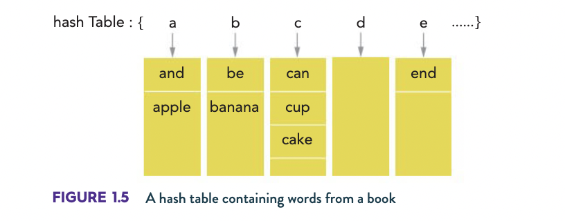

# Computer Science

!!! danger

    This is a work in progress. Some information may be incorrect or outdated

!!! note

	Lots of this content is not applicable to the study design. Consider it extra-curricular or supplimental

## Variables

### Data operators

#### Instructions

An instruction is a small unit of code. It is either a:

- [Definition](#definition) of a [variables](#variables)
- Or a [statement](#statement)

##### Definition

Assigning a value to a variable

```js
FOO := 123
```

##### Statement

A single action

```js
PRINT "abc"
```

#### Fundamental data types:

| Operation                          | Symbol              |
| ---------------------------------- | ------------------- |
| Addition                           | +                   |
| Subtraction                        | -                   |
| Multiplication                     | \*                  |
| Division                           | /                   |
| Whole number division (`int(x/y)`) | //                  |
| Remainder after division (#Modulo)  | %                   |
| Powers                             | \*\*                |
| Assign values                      | =, $\leftarrow$, := |

#### Data type comparison operations

| Operation                            | Symbol |
| ------------------------------------ | ------ |
| Less than $<$                        | <      |
| Less than or equal to $\leqslant$    | <=     |
| Greater than $>$                     | >      |
| Greater than or equal to $\geqslant$ | >=     |
| Equal to $\equiv$                    | \==    |
| Not equal to $\neq$                  | !=     |


#### Modulo 

Returns the remainder of an operation

Not to be confused with modulus. 

> **"modulo" is an operator**. For instance, we might say "19 and 64 are congruent modulo 5". "modulus" is a noun. It describes the 5 in "modulo 5".2 Apr 2021

### Data types

#### Integers

Number of integers for a number assigned with $n$ bits is:

$$2^n-1$$

>Unsigned: $0$ to $2^k-1$  
>Signed: $-2^{k-1}$ to $2^{k-1}-1$
>
>[Source](https://stackoverflow.com/a/3809058/14141223)

#### Floating point

Computer decimals that contain 2 parts:

- Significand
	- Which contains numbers in decimal (positive or negative)
- Exponent
	- Determines where to place the decimal point

#### Character

 Also known as a char. Chars are individual symbols that are identified via a number. Char schemes include:

- ASCII
	- English letters and grammar
- UTF-8 
	- Thousands of symbols

#### Boolean

`True` or `False`, `0` or `1`.

Can be represented differently in different languages

#### Primitive data types

!!! info "VSV 3.3 Abstract Data Types (ADTs)"

	**Primitive Data types you know from Maths:** {Integers, Reals, Complex Numbers, Irrational numbers,......} 

	**Primitive Data types from English:** {vowels, consonents, words....}


### Data structures

Also known as Abstract Data Types or ADTs

#### Array

A list of values

```js
[0,1,2,3,4,5]
["a","b","c"]
```

#### List

An array that supports multiple types of variables and is able to undergo several operations.

##### Cons method

The List ADT standardly includes a special method called "cons", short for construct, with the following [signature specification](#type-signature):

```signature
cons: item × List → List
```

The behaviour of this operation is the inverse of the first and rest operations above. In other words, for any list l, if we "cons" the head of l with the rest of l, we get l. (Formally, for all non-empty lists l, cons(first(l), rest(l)) = l.)

#### Associative array

Also called a *Dictionary*. An array of keys and values

```js
associcativeArray[key]
```

Associative array methods:

- `.add()`
- `.remove()`
- `.change()`

#### Hash table

A Hash Table is a type of [associative array](#associative-array) that uses a `(key,bucket)` layout. Where the bucket (or slot) is accessed via the key using hashes to instantly traverse to the end value. Which is usually preferred over other types of arrays.



##### Perfect Hash function

When the [hash table](#hash-table) has one hash per item in the array

#### Queue

Queues are a list of values sorted by entry time. A FIFO (first in first out) system. The first value in is first value out. New values are added at then end of the line via (`enqueue`). Common methods include:

- `enqueue()`
	- Inserts a value at the end of the queue
- `dequeue()`
	- Removes and returns the value from the front of the queue
- `front()`
	- Returns a value from the front of the queue without removing it
- `size()`
	- Returns the number of elements in the queue

##### Priority Queue

A priority queue is like a [queue](#queue), only you can specify the priority for an element when you add it, and you can modify the priority of an element that's in the queue.

###### Minimum priority queue

When the highest priority item is measured by the lowest weight

```txt
// [value, weight]
MinPQ = [[abc,1],[def,2]]
```


###### Maximum priority queue

When the highest priority item is measured by the highest weight

```txt
// [value, weight]
MaxPQ = [[abc,2],[def,1]]
```

#### Stack

A stack is similar to a [queue](#queue), but new values are added to the front of the stack, and values are taken from the front as well. Which can be explained as washing a stack of dishes top to bottom, but new dishes are placed on the top. Which is a LIFO (last in first out) system.

Methods:

- `push()`
	- Insert at top of stack
- `pop()`
	- Remove and return item at top of stack
- `top()`
	- Returns last inserted item without removing it
- `empty()`
	- Returns a bool on weather or not the stack is empty
- `size()`
	- Returns number of items in stack

#### Linked list

A linked list is an ordered set of elements where the next element in included as a pointer.

A **Doubly** linked list has pointers for back and fourth down the link chain

The advantage of a linked list is to add data into a large list. If i added an element at the start of the link, i would only need to add the link at the end of the array with its pointer going to the second element in the list. Rather than reindexing the entire array.

Common methods:

- `head()`
	- Returns the first element in the linked list
- `tail()`
	- Returns the last element in the linked list
- `next()`
	- Returns the next element in the linked list based in the selected element
- `previous()`
	- Returns the previous element in the linked list based on the selected element

#### Records

Also known as:
- Structs
- Fields

Records are like objects that have fixed variables/values. For example, a record may be called `customer` and only contain information such as `name` and `number`.

#### Class

A class is the outline for an object; containing parameters, variables and methods for each object.

##### Object

An instance of a [method](#method).

##### Method

A function in a [class](#class) to be run on the object (`self`)

##### Event

An event is a special type of [method](#method) this is "triggered" based on if an object's state changes. It is designed to react to changes within an object.

---


### Type signature

Also known as a signature specification. [Definition](https://encyclopediaofmath.org/wiki/Signature_(Computer_Science))

Example:

```txt
all_the_edges: Graph → set(edge)
```

and

```signature
true: ⟶ BOOL
false: ⟶ BOOL

NOT: BOOL ⟶ BOOL
AND: BOOL × BOOL ⟶ BOOL
OR: BOOL × BOOL ⟶ BOOL
```

A signature consists of the name of a [data operator](#operations), the [types](#data-types)(s) of its input(s) and the type of its output

In the form:

```txt
function name: input1type x input2type ⟶ output1type 
```


## Programming

### Programming levels


#### Low level programming languages

A low level programming language has little to no abstraction from machine code

E.g:
- Assembly
- Binary (literally)

#### High level programming languages

A high level programming language a lot of abstraction from machine code.

E.g:
- Edgy
- Python
- C++
	- A *lower*, high-level language

### Boolean Algebra

Operator symbols:

| Operator |      Symbol       | Working                     |
| -------- |:-----------------:| --------------------------- |
| [AND](#and) |      $\land$      | Needs both inputs to be `1` |
| [OR](#or)  |      $\lor$       | Needs one input to be `1`   |
| [NOT](#not) | $\lnot$ or $\sim$ | Swaps `0`,`1`               |

#### OR

One input must be true, to return true.


#### AND

Both inputs must be true, to return true.


#### NOT

Input is swapped. True goes to false, and false to true.


### Operations

#### Primitive operations

Primitive operations are basic computations performed by an algorithm.

Examples:
- evaluating an expression
- Assigning a value to a variable
- Indexing into an array
- Calling a method
- Returning from a method

!!! note

	[https://www.cpp.edu/~ftang/courses/CS240/lectures/analysis](https://www.cpp.edu/~ftang/courses/CS240/lectures/analysis.htm#:~:text=Primitive%20operations%20are%20basic%20computations,independent%20from%20the%20programming%20language.)


## Turing machine


- The Turing machine can either: edit erase or read the **infinite tape**
- Each cell can contain one symbol from the finite *alphabet* of machine symbols
- The machine follows programs, stored in the head of the reader
  - | Read data | Write instruction | Move instruction |
| --------- | ----------------- | ---------------- |
| *blank*   | *none*            | *none*           |
| `1`       | `0`               | right once       |
| `0`       | `1`               | right once       |


!!! info

	<iframe width="560" height="315" src="https://www.youtube.com/embed/dNRDvLACg5Q?start=116" title="YouTube video player" frameborder="0" allow="accelerometer; autoplay; clipboard-write; encrypted-media; gyroscope; picture-in-picture" allowfullscreen></iframe>

	[Revision](https://youtu.be/dNRDvLACg5Q?t=116) 

### Deterministic Turing machine

A [Turing machine](#turing-machine) that follows fixed rules. **A natural or realistic Turing machine**

### Nondeterministic Turing machine

Can solve NP problems?

A theoretical [Turing machine](#turing-machine) whose governing rules specify more than one possible action when in some given situations. That is, an NTM's next state is _not_ completely determined by its action and the current symbol it sees, unlike a [Deterministic Turing machine](#deterministic-turing-machine)

### Universal Turing Machine

A [Turing machine](#turing-machine) that can simulate any other Turing machine with any finite input. Usually where the program code and input is stored on the tape.

### State table

You can set functions (states) that contain different sets of instructions

| State       | Read data | Write instruction | Move instruction | Next state     |
| ----------- | --------- | ----------------- | ---------------- | -------------- |
| **State 0** | *blank*   | *none*            | *none*           | **Stop state** |
|             | `0`       | `1`               | right once       | **State 0**    |
|             | `1`       | `0`               | right once       | **State 0**    | 

- A **stop state** terminates the program
- This table reverses all bits


#### Finite state machines

| State       | Read data | Write instruction | Move instruction | Next state     |
| ----------- | --------- | ----------------- | ---------------- | -------------- |
| **State 0** | *blank*   | `blank`           | left once        | **State 1**    |
|             | `0`       | `1`               | right once       | **State 1**    |
|             | `1`       | `0`               | right once       | **State 0**    |
| **State 1** | *blank*   | `blank`           | right once       | **Stop state** |
|             | `0`       | `1`               | left once        | **State 1**    |
|             | `1`       | `0`               | left once        | **State 1**               |

- For the write instruction, `none` has been changed to `blank` for uniformity's sake (so that only the machine's symbols are referred to), and it should be noted that they are equivalent.

### State diagram


### Formal definition

$$
δ(q, 0) = (q, 0, R)
$$

q is the state, 0 (left) is read, 0 (right) is right, R is move right command

$$
δ(q, 1) = (f, 0, R)
$$
$$
δ(q, B) = (q, 1, L)
$$